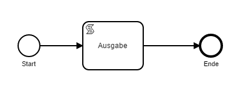
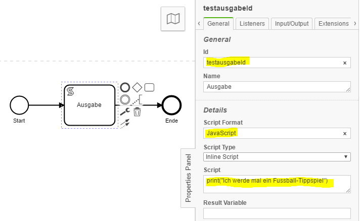
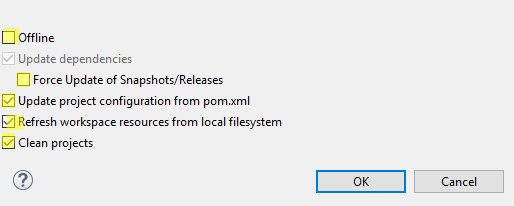
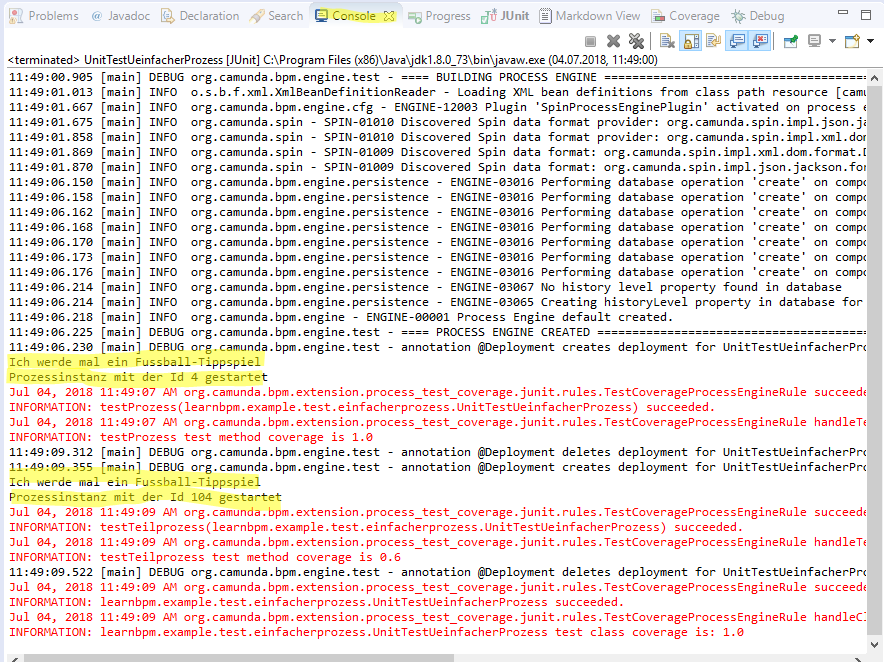
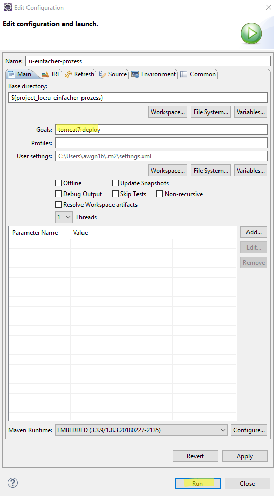
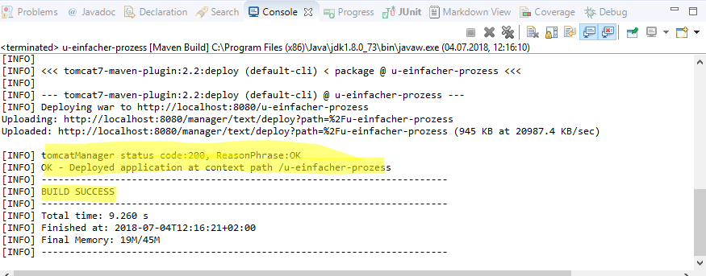
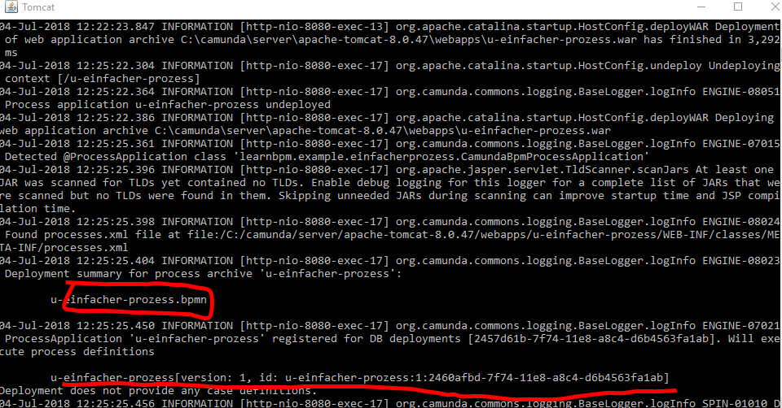
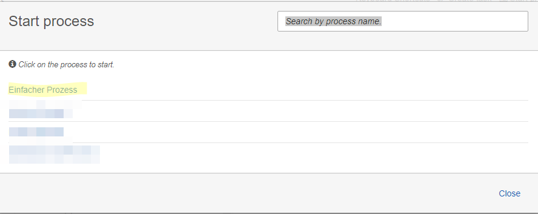

# Übung "Einfacher Prozess"

## Voraussetzungen

1. Eclipse-Projekt `u-einfacher-prozess` importieren (siehe auch Dokument _Kochrezept Camunda-Projekt importieren_)
2. POM anpassen

## Übung

1. Prozessmodell erstellen
  1. Prozessmodelldatei  `/u-einfacher-prozess/src/main/resources/u-einfacher-prozess.bpmn` mit Camunda-Modeler öffnen
  2. Prozesselemente erstellen

  3. Skript-Task erstellen und alle Attribute füllen

  

## Testen

### Projekt aktualisieren
1. Projekt mit _F5-Taste_ refreshen
2. Rechtsklick auf Projektordner und dann  _Run As -> Maven clean_ um Maven zurückzusetzen
3.  Rechtsklick auf Projektordner  _Maven-> Update Project ..._  dann Projekt anhaken (**Checkboxen beachten!**, siehe unten) und _OK_

### Test starten

Rechtsklick auf Java-Datei `/u-einfacher-prozess/src/test/java/learnbpm/example/test/einfacherprozess/UnitTestUeinfacherProzess.java`  und dann _Run As -> JUnit Test_

Ergebnisse:

 

**Info:**
Die Testmethoden `learnbpm.example.test.einfacherprozess.UnitTestUeinfacherProzess.testProzess()` und `learnbpm.example.test.einfacherprozess.UnitTestUeinfacherProzess.testTeilprozess()` wurden vorab erstellt. Eine andere Übung beschäftigt sich mit dem Erstellen von Tests.

## Projekt deployen (in Camunda-Engine spielen)

1. Projekt aktualisieren (siehe [Test starten](#test-starten)) TODO Verlinkung
2. Rechtsklick auf Projektordner und dann  _Run As -> Maven build..._
3. Im Konfigurationsfenster unter Goals `tomcat7:deploy` beim ersten deployen eingeben; ist das Projekt schon mal deployed worden, dann `tomcat7:redeploy` eingeben und mit _OK_ ausführen

Ergebnis eclipse-Konsole:

Ergebnis Tomcat-Log:

## Prozess in camunda starten
1. IM Browser die Tasklist öffnen: `http://localhost:8080/camunda/app/tasklist/default/#/login`
2. Mit Admin einloggen (demo/demo)
3. Rechts oben "Start process" anklicken
4. Prozess im Fenster durch Anklicken auswählen

5. Im Folgefenster roten Knopf "Start" betätigen

Ergebnis im Tomcat-Log:

## Doku/ weiterführende Quellen

## Lösung
